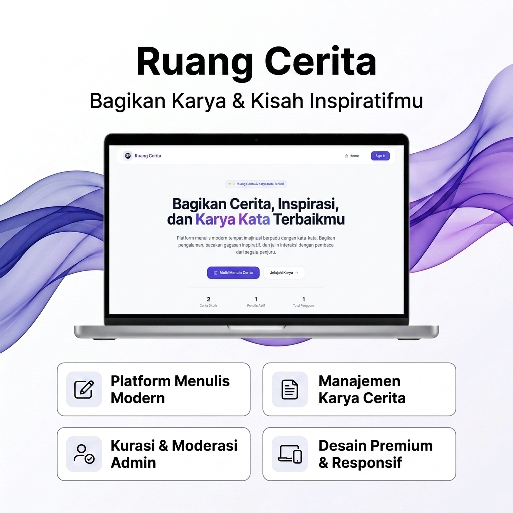

# 📖 Ruang Cerita & Karya Kata

**Ruang Cerita** adalah platform menulis modern yang dirancang khusus untuk membagikan karya tulis, gagasan, opini, cerita pendek, dan kisah inspiratif terbaik dari seluruh penjuru dunia. Platform ini mengutamakan kenyamanan membaca dan kebebasan menulis melalui tampilan antarmuka yang bersih, premium, dan intuitif.

🚀 **Live Website:** [room-story.natagw.my.id](https://room-story.natagw.my.id)

---

## 🎨 Pamphlet & Poster Pameran

Berikut adalah rancangan desain poster pameran resmi untuk platform **Ruang Cerita**:



---

## ✨ Fitur Unggulan

Platform ini dilengkapi dengan berbagai fitur modern guna menyajikan pengalaman menulis digital yang luar biasa:

*   **Platform Menulis Modern (Rich Text Editor)**: Integrasi CKEditor modern yang responsif dan fleksibel untuk menyusun draf cerita dengan formatting lengkap.
*   **Manajemen Cerita Lengkap (CRUD)**: Pengguna memiliki kendali mandiri untuk menambah, mengubah, dan menghapus tulisan mereka sendiri.
*   **Sistem Kurasi & Moderasi Admin**: Fitur moderasi khusus admin untuk menyetujui (*approve*) atau menolak (*reject*) cerita kontributor demi menjaga kualitas konten platform.
*   **Otentikasi Aman (Auth)**: Halaman *login* dan *register* yang dirancang aman, terisolasi dari *navbar* utama, dilengkapi fitur intip sandi (*toggle password visibility*), serta terkunci rapat (*viewport-fixed*) untuk kenyamanan maksimal di layar HP.
*   **Desain Premium & Responsif**: Dibangun dengan tipografi premium *Plus Jakarta Sans*, tata letak yang bersih, antrean menu responsif (*mobile hamburger menu*), serta terbebas sepenuhnya dari *scroll bug* horizontal/vertikal.
*   **Easter Egg Page (`/dev`)**: Halaman tersembunyi khusus profil pengembang (**Natagw**) yang memuat deskripsi pembuat serta tautan ke portofolio utama [me.natagw.my.id](https://me.natagw.my.id).

---

## 💻 Tech Stack

Aplikasi ini dikembangkan menggunakan teknologi terkini di dunia web development:

*   **Framework**: [Next.js 14](https://nextjs.org/) (App Router & React Server Components)
*   **Styling**: [TailwindCSS](https://tailwindcss.com/) & [DaisyUI](https://daisyui.com/)
*   **Otentikasi**: [Auth.js / NextAuth](https://next-auth.js.org/)
*   **Editor**: [CKEditor 5](https://ckeditor.com/ckeditor-5/)
*   **Icons**: [React Icons](https://react-icons.github.io/react-icons/)
*   **Database**: MySQL (Terintegrasi)

---

## 🛠️ Langkah Menjalankan Project

Ikuti instruksi berikut untuk menjalankan aplikasi di komputer lokal Anda:

### 1. Kloning Repositori
```bash
git clone <repository-url>
cd ruang-cerita-natagw
```

### 2. Instalasi Dependensi
```bash
npm install
```

### 3. Konfigurasi Environment Variables
Buat file `.env` di direktori utama dan lengkapi konfigurasi berikut (sesuaikan dengan database dan NextAuth):
```env
DATABASE_URL="your-database-url"
NEXTAUTH_SECRET="your-nextauth-secret"
# Tambahan OAuth config jika menggunakan provider Google/GitHub
```

### 4. Menjalankan Server Development
Jalankan dev server secara lokal:
```bash
npm run dev
```
Buka [http://localhost:3000](http://localhost:3000) pada browser Anda.

### 5. Membuat Build Produksi
Untuk mengecek validasi tipe dan membuat build produksi yang dioptimasi:
```bash
npm run build
```

---

## 👤 Pengembang (Developer)

Dikerjakan secara penuh oleh **Natagw**. 
Kunjungi website portofolio resmi saya di: **[me.natagw.my.id](https://me.natagw.my.id)**
